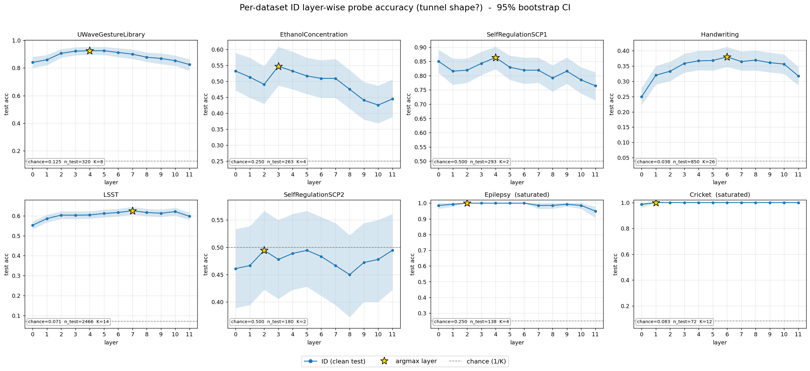
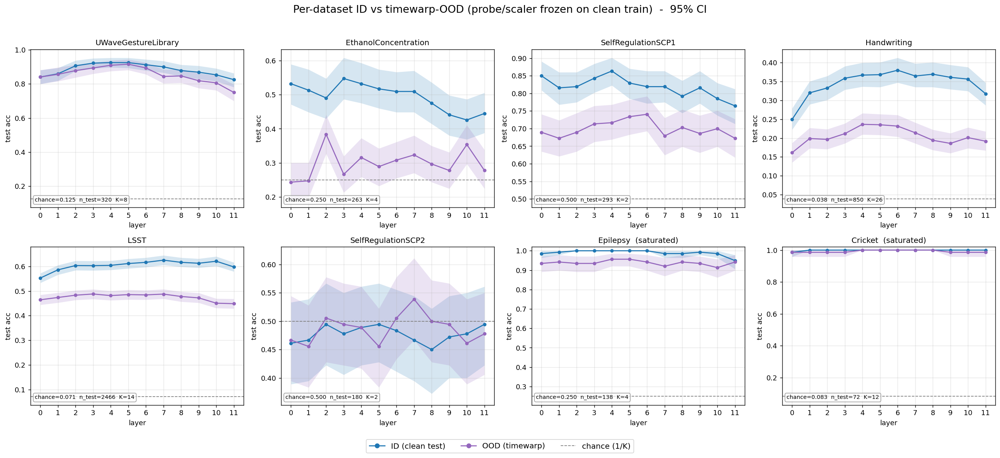
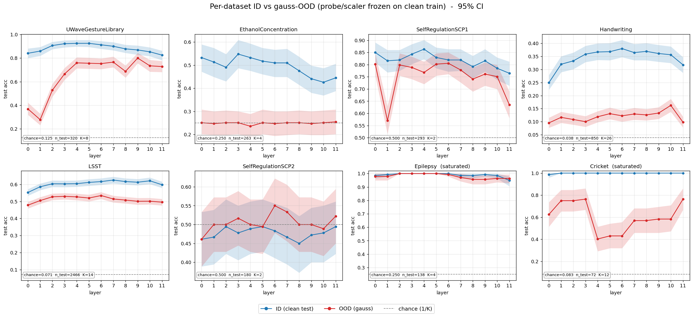
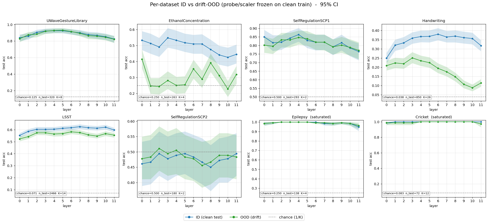
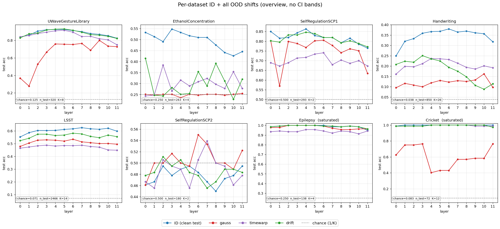

# Per-dataset layer-wise probing: ID vs OOD (redraw + re-check)

Following the feedback that the earlier figures collapsed each dataset into a single
number, here are **per-dataset, per-layer** curves so the ID→OOD change is visible at every
layer — plus a per-dataset re-check of whether the tunnel shape appears in each.

**Figures**
- `fig_grid_id_tunnel` — ID probe accuracy by layer, one panel per dataset → *the tunnel shape*.
- `fig_grid_idood_gauss` / `_timewarp` / `_drift` — ID vs each OOD shift, per dataset.
- `fig_grid_idood_all` — ID + all three shifts overlaid (overview).
- `perdataset_summary.json` — all numbers + raw per-layer arrays.

*8 datasets, ordered strong → weak → saturated reference. Probe = linear logistic regression
per layer on frozen Chronos-2 features (StandardScaler on train only); 95% bootstrap CIs;
"late-drop" = pre-declared middle band (L3–8) minus last layer (L11). Epilepsy & Cricket are
saturated (flat ID curves at ceiling) — shown as reference only, excluded from the claims.*

---

## Finding 1 — the tunnel shape holds, per dataset

The ID curves show the rise → plateau → late-drop shape in every headroom dataset, with the
peak (argmax) sitting in the **middle band (L3–L7), not at the last layer**. The last-layer
deficit (mean L3–8 − L11) is positive with its 95% CI excluding 0 in **5 of 6** non-saturated
datasets:

| dataset | domain | chance | late-drop (ID), 95% CI | sig? | argmax |
|---|---|---|---|---|---|
| UWaveGestureLibrary | gesture | .125 | +0.085 [.051, .122] | ✓ | L4 |
| EthanolConcentration | chem. spectra | .250 | +0.070 [.013, .122] | ✓ | L3 |
| SelfRegulationSCP1 | EEG | .500 | +0.063 [.028, .098] | ✓ | L4 |
| Handwriting | handwriting | .038 | +0.050 [.026, .075] | ✓ | L6 |
| LSST | light-curves | .071 | +0.015 [.000, .029] | ✓ (borderline) | L7 |
| SelfRegulationSCP2 | EEG | .500 | −0.018 [−.091, .058] | ✗ | — |

- **SCP2** is the lone null — its probe sits near chance at every layer, so it's *underpowered*,
  not a counterexample.
- **LSST** is borderline (lower CI edge at 0.000) — a real but very small effect, resolvable
  only because its test set is large (2466).

➡️ Across EEG, handwriting, gesture, spectra and light-curves, the middle layers carry more
linearly-decodable class information than the final layer.

---

## Finding 2 — OOD damage is shift-dependent and **not** last-layer-concentrated (amplification null)

The redrawn grids reveal that the OOD curves do **not** behave uniformly — the shape depends on
the shift, and the damage is generally *not* concentrated at the last layer (which is exactly
what Part 2 predicted):

- **Timewarp** (`fig_grid_idood_timewarp`): the OOD curve sits roughly **parallel** below ID in
  every headroom dataset — it degrades all layers about equally → no amplification.
- **Gaussian noise** (`fig_grid_idood_gauss`): where resolvable, the damage concentrates at the
  **early** layers, not the late ones — UWave and SCP1 crater at L0–L1 and recover by the middle.
  That is the *opposite* of the tunnel prediction, which is why several gauss cells come out
  **negative** (UWave/gauss −0.082, sig). The one exception is SCP1, whose last layer also
  collapses (L11 → 0.63), giving the lone positive gauss cell (+0.082). On the hardest tasks
  (Ethanol, Handwriting) gauss floors the probe near chance at all layers.
- **Drift** (`fig_grid_idood_drift`): mostly mild / overlapping with ID, except Handwriting,
  where OOD peels away more at the late layers (+0.040, the one pro-tunnel drift cell), and
  Ethanol, which degrades erratically (−0.086, sig negative).

Tallying the 18 non-saturated amplification cells (mid-vs-last gap, OOD − ID): **3
positive-significant** (SCP1/gauss, UWave/timewarp, Handwriting/drift), **2 negative-significant**
(UWave/gauss, Ethanol/drift), and 13 indistinguishable from 0 — scattered across different
datasets and shifts, with as many hits in the *wrong* direction as the right one. That is the
signature of no real effect (multiple-comparison noise).

➡️ The last-layer-preferential degradation Part 2 predicted does not appear. If anything, the
most input-like shift (Gaussian) hits the **early** layers hardest — consistent with early
layers being closest to the raw input — which is a *different* phenomenon from the tunnel effect.

---

## Bottom line

- **Part 1 (tunnel shape: middle > last) — robust, per dataset.** 5/6 non-saturated datasets,
  middle argmax (L3–L7), across five distinct domains.
- **Part 2 (gap widens under shift) — null, per dataset and per shift.** The redrawn grids show
  OOD damage is *not* concentrated at the last layer; its location is shift-dependent, and for
  Gaussian noise it lands on the *early* layers. The few significant amplification cells are
  scattered and balanced by equally-significant cells in the opposite direction.
- **Saturated datasets (Epilepsy, Cricket)** are reference only — flat ID curves at ceiling;
  Cricket's large negative gauss amplification (−0.236) is just a saturated probe collapsing
  unevenly, not interpretable.

**Open question (unchanged):** the per-dataset tunnel shape could be the tunnel effect, or the
model being out-of-distribution on these domains. The clean disambiguation is matched probes on
an *in-distribution* vs *out-of-distribution* task — the late-layer deficit should grow with
distance from pretraining if it's truly the tunnel effect. The early-layer fragility under
Gaussian noise is a separate, input-coupling effect worth a short look on its own.

---
*Numbers and raw per-layer arrays in `perdataset_summary.json`.*
